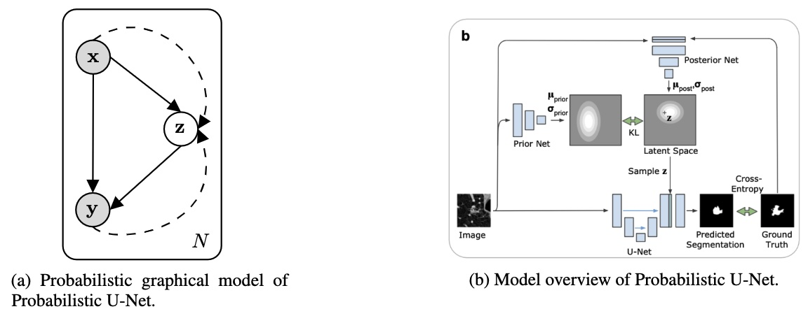
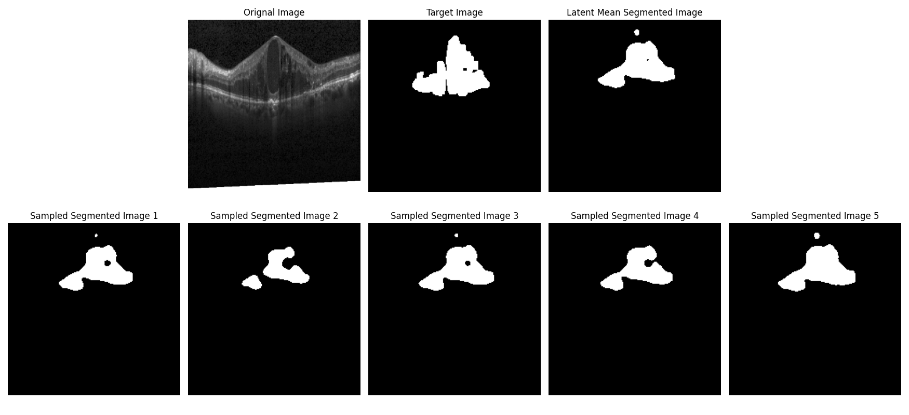

# Probabilistic U-Net

Implementaion of deep neural network combining probabilistic graphical model and u-net for modeling uncertainty problem in the field
of medical image understanding. This is for the CS 274B Probabilistic Graphical Model course project at UC Irvine.



## Dataset
We test our model performance on OCT image segmentaion task.
The dataset processed from `boe_chiu` dataset which includes train: 86 test: 28. Download link:
[train](https://drive.google.com/file/d/1PiBaXNbBpKIkKz33EfVTjR3pR2Dx8XH9/view?usp=sharing) and [test](https://drive.google.com/file/d/1TXbxrufaBpq2fWCkl1iMCw8nbIXOep2e/view?usp=sharing).

## Training

### U-Net Baseline

Use index to indicate which gpu card you are going to use

```bash
sh script/train_unet.sh [gpu_id]
```

### Probabilistic U-Net

```bash
sh script/train_prob_unet.sh [gpu_id]
```

## Sampling Results
Below are segmentation results sampled from latent distribution


## References
Kohl, Simon, et al. "A probabilistic u-net for segmentation of ambiguous images." Advances in neural information processing systems 31 (2018).
